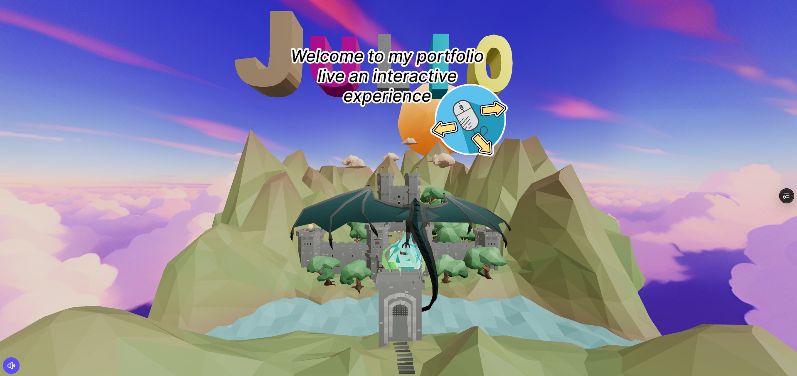
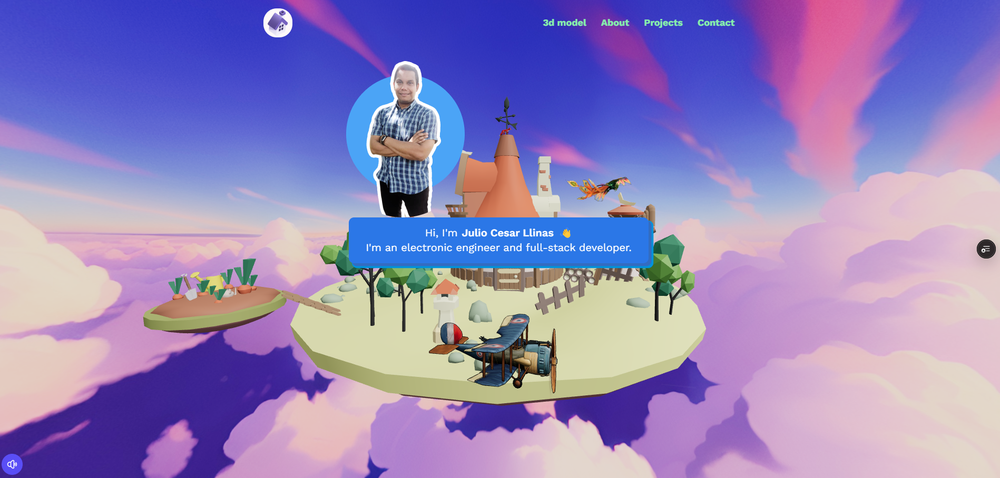

# PORTAFOLIO

# Three.js

Three.js es una biblioteca de JavaScript que permite crear y mostrar gráficos 3D en el navegador de manera sencilla y eficiente. Utiliza WebGL para renderizar escenas 3D, lo que facilita la creación de experiencias visuales interactivas y dinámicas directamente en la web.

En este proyecto, he utilizado Three.js para [describir brevemente lo que haces en tu portafolio, por ejemplo: "crear un entorno 3D interactivo que muestra mis proyectos de desarrollo web y diseño gráfico"]. La biblioteca me ha permitido integrar modelos 3D, luces, sombras y animaciones, ofreciendo una experiencia visual atractiva y moderna.

install: npm install

----------------------------------------------------------------

.env

VITE_APP_EMAILJS_SERVICE_ID=
VITE_APP_EMAILJS_TEMPLATE_ID=
VITE_APP_EMAILJS_PUBLIC_KEY=

----------------------------------------------------------------

start:

npm run dev